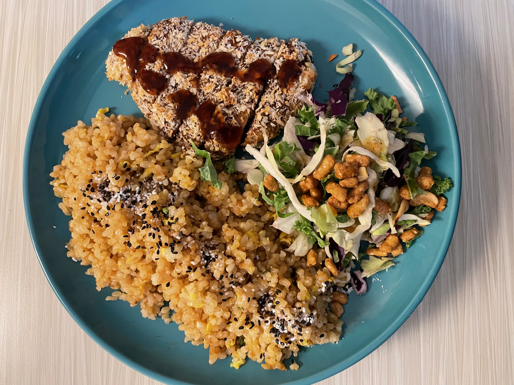
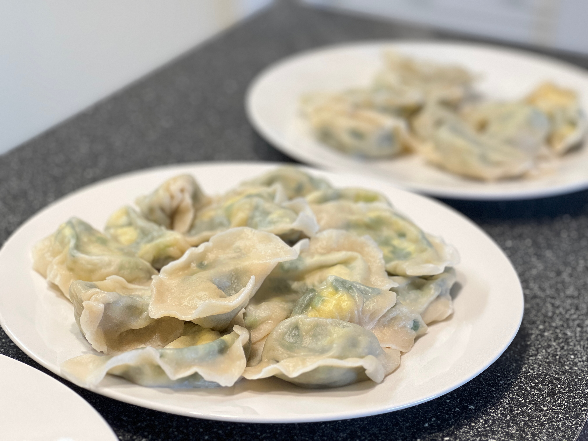

## 🎼 Music ##
I have a passion for music as much as AI. I play the acoustic guitar, electric guitar and drum kit. I used to play in a rock band in my high school. Oddly enough, I was the drummer even though I didn't know how to drum when we started. Nevertheless, it was an incredible period of my life. I enjoyed every minute of playing on the stage. Nowadays, I play more fingerstyles because it isn't as fun strumming chords to myself as playing them with the folks. I have been gaining interest in neo-soul guitar for the past couple of months. I might give it a try this year. I own a Yamaha FS-TA TransAcoustic guitar. The all-in-one reverb and chorus are brilliant!

My go-to music genre is still Rock and Roll, but I have also been exploring other types of music. Recently, I've been pretty into J-pop, Britpop and Mandarin rock. Below is a partial listing of bands/individuals I love to listen to by genre.

- **J-pop:** King Gnu, X Japan (RIP Heath), One Ok Rock, Yorushika, Yoasobi, Radwimps, MAISONdes, Kenshi Yonezu, Vaundy, Minami 373, ...
- **Britpop:** The Beatles, Oasis, Blur, Suede, Radiohead, The Verve, ...
- **Mandarin rock:** Cui Jian, Dou Wei, He Yong, Zhang Chu, Tang Dynasty, GALA, Omnipotent Youth Society, No Party For Cao Dong, ...
- **Progressive Rock:** Pink Floyd, Polyphia, ...
- **Electric:** Yellow Magic Orchestra, ...
- **Fingerstyle:** Masaaki Kishibe, Kotaro Oshio, Kim Youngso, Sungha Jung...

## 🍳 Cooking ##
Cooking gives me peace and satisfaction. Not only do I cook dishes from my cultural background, but I also love to learn and experiment with cuisine from other parts of the world. Below are some of the dishes I cook that are decent presentation-wise (and tasty, of course).

    

        
        
Air-fried Tonkatsu

    

    

        
        
 Chinese Dumpling (Jiaozi) Stuffed with Minced Garlic Chives and Scrambled Eggs

    

    

        
        
Braised Beef and Potato with Tomato Base

    

    

        
        
 Japanese Chicken Curry

    

## 🏀 Sports ##
I play a couple of recreational sports, such as basketball and badminton. I used to play intramural basketball in my undergraduate and master's. We had a lot of fun. I wish to learn table tennis in 2024.
## 👻 Other Random Stuff ##
- The best movie I watched in 2023 was *An Elephant Sitting Still (大象席地而坐)*.
- I am learning [JAX](https://github.com/google/jax) and implementing some (deep) reinforcement learning algorithms with it.
I am sporadically updating a [repo](https://github.com/LeonardoWjq/RL-Algorithms) of my code.
- My favourite game(s) is the Persona series. I play them on my Nintendo Switch.
- I am semi-seriously learning French and Japanese. Feel free to reach me if you need a language partner. I am a native (Mandarin) Chinese speaker and speak English reasonably well.
- My MBTI is INFJ-T.